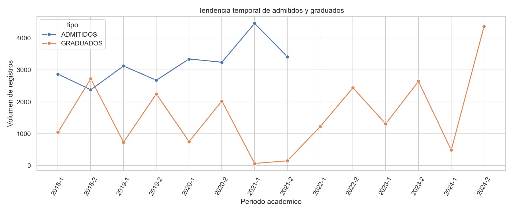
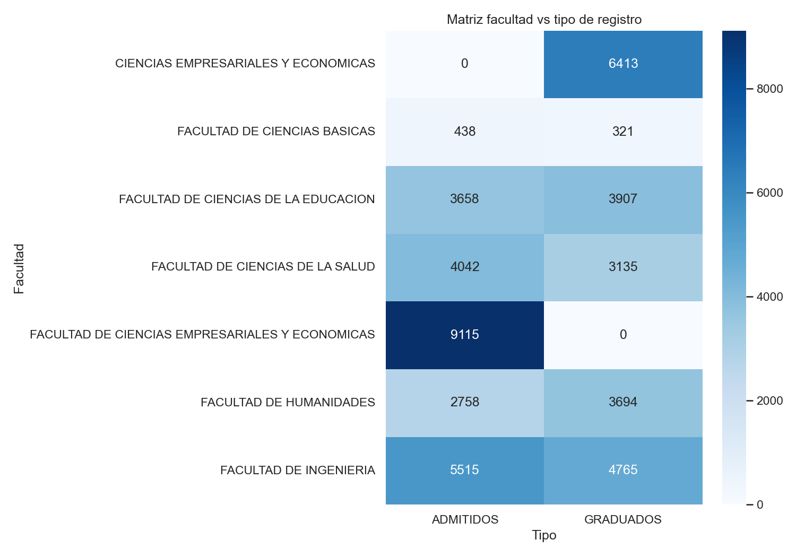
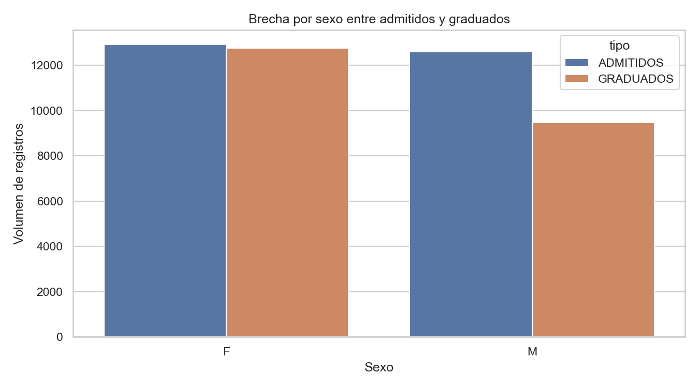

# Probando tecnologias nuevas: Python + Streamlit

Hoy publico un proyecto de analisis de datos enfocado en admitidos y graduados, construido con **Python** y desplegado como dashboard con **Streamlit**.

## Lo mas importante del proyecto

- Pipeline reproducible de analisis (`analysis_pipeline.py`)
- Dashboard interactivo (`app.py`)
- Informe tecnico ejecutivo (`README.md`)


## Hallazgos de referencia

- Registros finales limpios: **47,761**
- Duplicados removidos: **137**
- Evidencia inferencial significativa en variables clave
- Reproducibilidad validada con hashes identicos entre corridas

## Como ejecutarlo

```bash
pip install -r requirements.txt
python analysis_pipeline.py
streamlit run app.py
```
---

Si quieres, te comparto una segunda version con enfoque en storytelling para portafolio o para presentacion ejecutiva.

# Informe Final - Analisis de Admitidos y Graduados (UNIMAG)

## Resumen ejecutivo

- Registros analizados: **47,761** (tras remover 137 duplicados).
- Balance mediano admitidos/graduados por periodo: **1.03**.
- Se evidencian diferencias estadisticamente significativas por sexo y estrato frente al tipo de registro (admitido/graduado).
- El flujo analitico fue validado como **reproducible** con hashes identicos en corridas consecutivas.

## Resultados inferenciales principales

- Chi-cuadrado `sexo` vs `tipo`: `p=2.58e-49`, Cramers V=`0.068`.
- Chi-cuadrado `estrato` vs `tipo`: `p=1.217e-34`, Cramers V=`0.060`.
- Z-test proporcion femenina (admitidos vs graduados): `p=0`, Cohen h=`-0.136`.
- Mann-Whitney edad (admitidos vs graduados): `p=0`, correlacion biserial de rangos=`-0.310`.

## Visualizaciones clave

### Tendencia temporal



### Segmentacion por facultad y tipo



### Brecha por sexo



## Recomendaciones para decision directiva

1. Priorizar seguimiento de cohortes con menor conversion de admitidos a graduados por programa.
2. Diseñar estrategias de permanencia focalizadas en segmentos con brechas demograficas.
3. Institucionalizar monitoreo semestral con el dashboard para reaccion temprana.

## Soporte tecnico


- Dashboard: `app.py`
